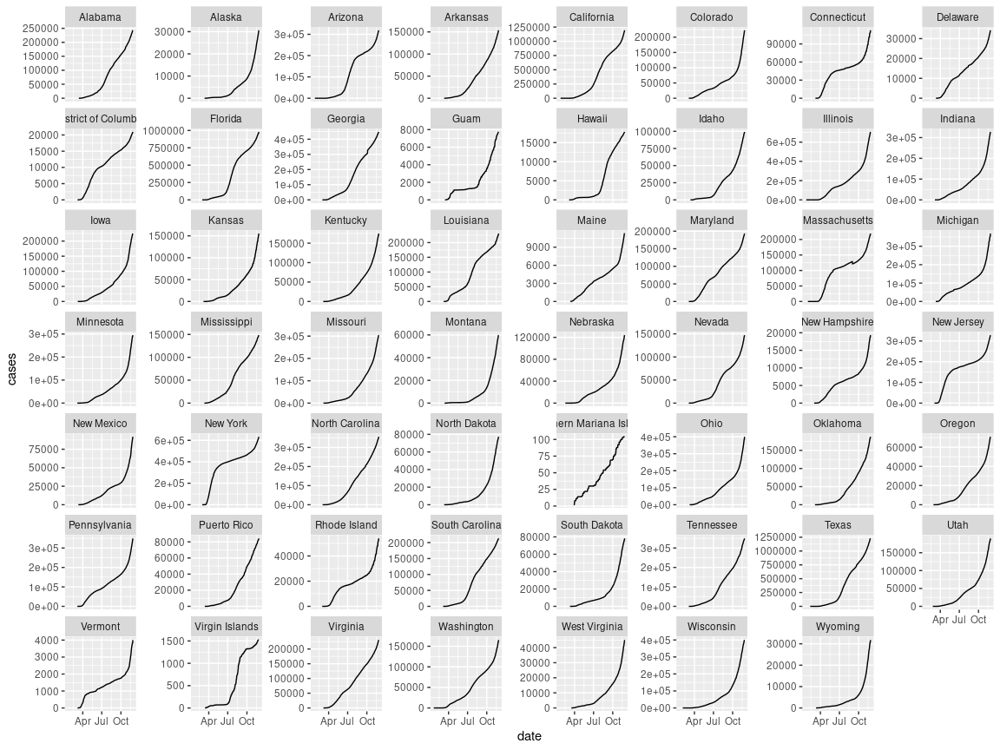

<!-- README.md is generated from README.Rmd. Please edit that file -->

# ndexrhome

<!-- badges: start -->

<!-- badges: end -->

The goal of ndexrhome is to …

## Installation

## Example

This is a basic example which shows you how to solve a common problem:

``` r
library(ndexrhome)
#> Loading required package: rmarkdown
#> Loading required package: dplyr
#> 
#> Attaching package: 'dplyr'
#> The following objects are masked from 'package:stats':
#> 
#>     filter, lag
#> The following objects are masked from 'package:base':
#> 
#>     intersect, setdiff, setequal, union
#> Loading required package: shinydashboard
#> 
#> Attaching package: 'shinydashboard'
#> The following object is masked from 'package:graphics':
#> 
#>     box
#> Loading required package: shiny
#> Loading required package: glue
#> 
#> Attaching package: 'glue'
#> The following object is masked from 'package:dplyr':
#> 
#>     collapse
#> Loading required package: stringr
#> Loading required package: readr
#> Loading required package: ggplot2
```

``` r
plot_covid_data()
#> 
#> ── Column specification ────────────────────────────────────────────────────────
#> cols(
#>   date = col_date(format = ""),
#>   county = col_character(),
#>   state = col_character(),
#>   fips = col_character(),
#>   cases = col_double(),
#>   deaths = col_double()
#> )
```


